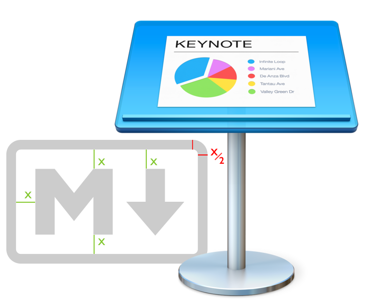
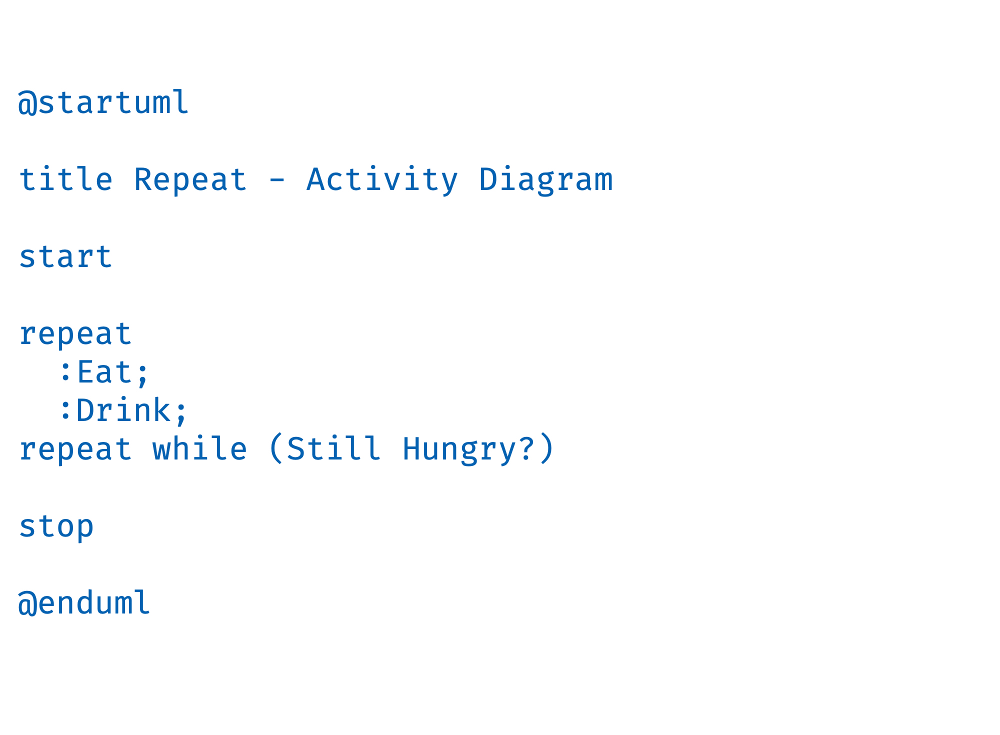
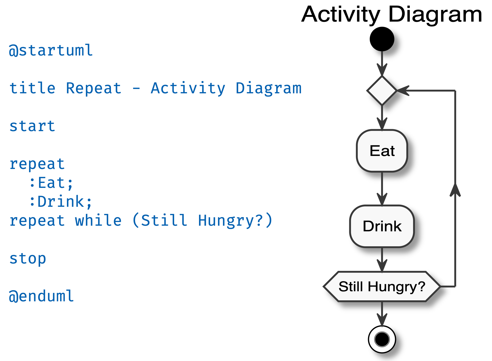
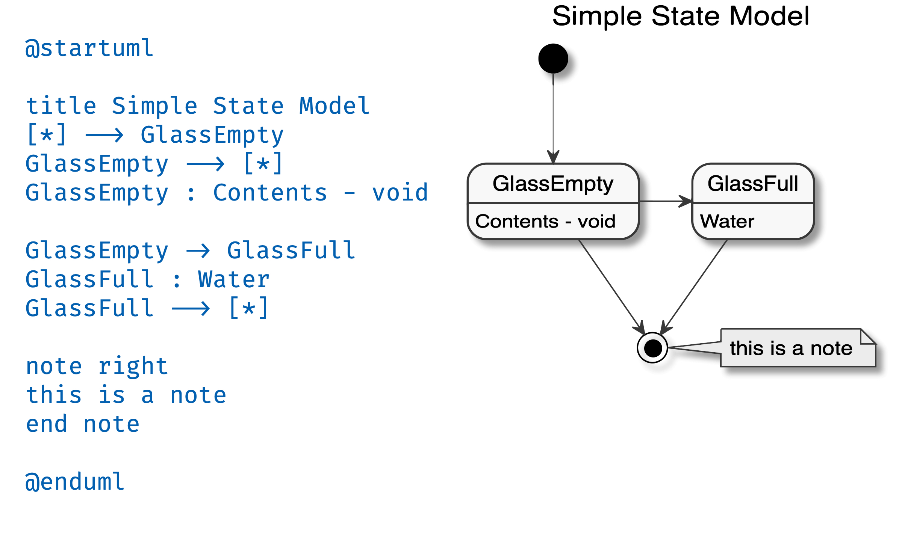
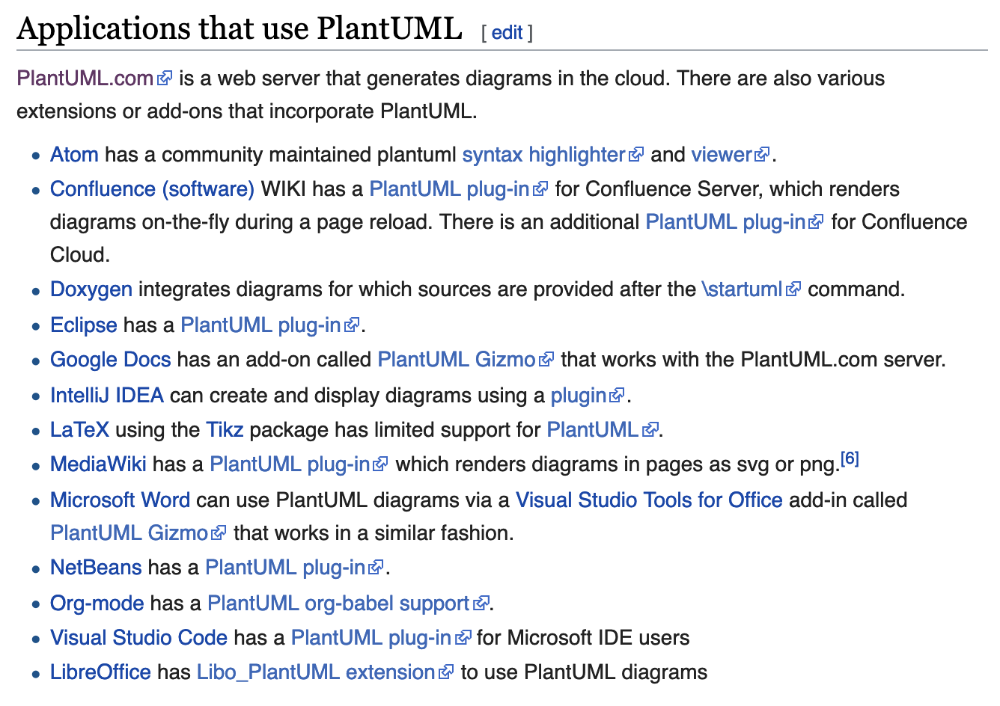

<!-- .slide: data-menu-title="Title slide" data-background-image="images/Salinas_Grandes.jpg" data-background-opacity="0.4" -->
## Tekst-gebaseerde tools,
### echt niet alleen voor nerds...

---

<!-- .slide: data-menu-title="Beetje nerdy?" -->

Het lijkt een beetje nerdy maar in deze sessie laat ik je de kracht zien van platte tekst (o.a. markdown). Met behulp van een eenvoudige editor en wat tools maken we:

- een statische website,
- documentatie,
- een presentatie en
- schema's in Confluence

Voordeel van deze tekst-gebaseerde tools is dat deze ook gemakkelijk te combineren zijn met versiebeheer tools zoals Git en daarnaast op alle platformen beschikbaar zijn.

---

<!-- .slide: data-menu-title="Markdown, hoe het begon" data-background-image="images/markdown-mark.svg" data-background-opacity="0.1" -->
## Markdown, hoe het begon ...

--

<!-- .slide: data-menu-title="Er was eens een prins" data-background-image="images/prince_john.gif" data-background-opacity="0.6" -->

## Er was eens een prins,

--

<!-- .slide: data-menu-title="zijn naam was John" data-background-image="images/prince_john.gif" data-background-opacity="0.6" -->

## zijn naam was John ...

--

<!-- .slide: data-menu-title="John Gruber" data-background-image="images/daring_fireball.png" data-background-opacity="0.3" -->
## **John Gruber**

"The overriding design goal for Markdown's formatting syntax is to make it as readable as possible. <!-- .element: class="fragment" data-fragment-index="1" -->

The idea is that a Markdown-formatted document should be publishable as-is, as plain text, <!-- .element: class="fragment" data-fragment-index="2" -->

without looking like it's been marked up with tags or formatting instructions." <!-- .element: class="fragment" data-fragment-index="3" -->

Note: 2004, ontwikkeld samen Aaron Swartz  No standard; "informal specification"

--

<!-- .slide: data-menu-title="Markdown and offspring" data-background-image="images/markdown-mark.svg" data-background-opacity="0.1" -->
## Markdown
### MultiMarkdown             <!-- .element: class="fragment" data-fragment-index="1" -->
### CommonMark                <!-- .element: class="fragment" data-fragment-index="2" -->
### GitHub Flavored Markdown  <!-- .element: class="fragment" data-fragment-index="3" -->

Gestandaardiseerd in RFC 7763 (Markdown) en RFC 7764 (MultiMarkdown, CommonMark en GFM) <!-- .element: class="fragment" data-fragment-index="4" -->

Note: GFM follows the CommonMark specification exactly except for tables, strikethrough, autolinks and task lists, which the GitHub spec has added as extensions

--

<!-- .slide: data-menu-title="Tower of Babel" data-background-image="images/babel_tower.jpg" data-background-opacity="0.4" -->

## Verschillen ?

## Verschillen ! <!-- .element: class="fragment" data-fragment-index="1" -->

## Werkbaar ?    <!-- .element: class="fragment" data-fragment-index="2" -->

## Werkbaar !    <!-- .element: class="fragment" data-fragment-index="3" -->

--

<!-- .slide: data-menu-title="MD & GFM documentatie" -->

## Markdown & GFM Documentatie

### GitHub [Mastering Markdown](https://guides.github.com/features/mastering-markdown/)

--

<!-- .slide: data-menu-title="Markdown online demo" -->
## Markdown online demo

### [marked.js.org/demo](https://marked.js.org/demo/)

--

<!-- .slide: data-menu-title="Markdown offline demo" data-background-image="images/Marked_2.png" data-background-opacity="0.4" -->
## Markdown offline demo

### with TextEdit & Marked 2

--

<!-- .slide: data-menu-title="Uncle Sam want's you" data-background-image="images/uncle_sam_wants_you.jpg" data-background-opacity="0.4" -->

---

<!-- .slide: data-menu-title="Statische websites via MD" -->
## Statische websites via Markdown

--

<!-- .slide: data-menu-title="Statische websites?" data-background-image="https://media.giphy.com/media/LF8plQNlgYwnK/giphy.gif" data-background-opacity="0.4" -->
## Statische website?

--

<!-- .slide: data-menu-title="Statische website" -->
### Statische website:
- geen database back-end
- pagina's bestaande uit HTML + CSS
- content is statisch
    - betere caching
    - betere performance
- veilig

--

<!-- .slide: data-menu-title="Voorbeeld sites" data-background-image="images/tig_transparent.png" data-background-opacity="0.1" -->
## Voorbeeld sites

### [tisgoud.nl](https://tisgoud.nl)

### [wheelies.nl](https://wheelies.nl)

### [devNetNoord](https://devnetnoord.github.io)

--

<!-- .slide: data-menu-title="StaticGen" data-background-image="images/StaticGen.png" data-background-opacity="0.1" -->
## Static Site Generators

### [StaticGen](https://www.staticgen.com)

--

<!-- .slide: data-menu-title="Britans eyes" data-background-image="images/eyes.jpg" data-background-opacity="0.4" -->

---

<!-- .slide: data-menu-title="Documentatie via Markdown" -->
## Documentatie via MarkDown

--

<!-- .slide: data-menu-title="MkDocs" -->
## MkDocs

MkDocs is a fast, simple and downright gorgeous static site generator that's geared towards building project documentation. Documentation source files are written in Markdown, and configured with a single YAML configuration file.

Note: Written in Python

--

<!-- .slide: data-menu-title="MkDocs URL" -->
## MkDocs

### [MkDocs](https://www.mkdocs.org)

--

<!-- .slide: data-menu-title="MkDocker" -->
## MkDocs with Material theme

--

<!-- .slide: data-menu-title="Now What?" -->

---

## Presentatie via Markdown

--

## Reveal.js

### [Reveal.js](https://revealjs.com)

--

<!-- .slide: data-menu-title="Content in externe MD" data-background-image="images/TextEdit.png" data-background-opacity="0.4" -->
## Content slides

in extern Markdown bestand.

---

<!-- .slide: data-menu-title="PlantUML" data-background-image="images/PlantUML.png" data-background-opacity="0.4" -->

## PlantUML 

PlantUML is an open-source tool allowing users to create UML diagrams from a plain text language. <!-- .element: class="fragment" data-fragment-index="1" -->

The language of PlantUML is an example of an Application Specific Language. <!-- .element: class="fragment" data-fragment-index="2" -->

It has been used to allow blind students to work with UML. <!-- .element: class="fragment" data-fragment-index="3" -->

--

<!-- .slide: data-menu-title="PlantUML URL" data-background-image="images/PlantUML.png" data-background-opacity="0.4" -->

## PlantUML URL

### [PlantUML](http://plantuml.com)

--

<!-- .slide: data-menu-title="Activity Diagram" -->

--

<!-- .slide: data-menu-title="AD with PlantUML" -->

--

<!-- .slide: data-menu-title="SM with PlantUML" -->

--

## PlantUML Online demo

### [PlantText](https://www.planttext.com/)

--

<!-- .slide: data-menu-title="PlantUML offline demo" -->
## PlantUML offline demo

--

## PlantUML supported apps

--

<!-- .slide: data-menu-title="Confluence demo" -->

---

<!-- .slide: data-menu-title="Title slide" data-background-image="images/Salinas_Grandes_road.jpg" data-background-opacity="0.4"  -->
## Bedankt voor jullie aandacht!

wat is jouw volgende stap?

